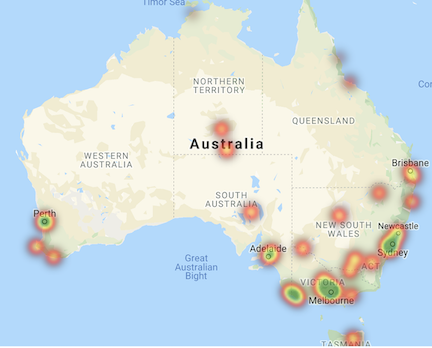

# Predicting tomorrow's rainfall in Australia

## Executive summary

The goal of this analysis is to predict whether it will rain tomorrow in a given city in Australia, based on today's weather. We analyzed a Kaggle dataset of daily weather data collected in 49 Australian cities between 2010 and 2018. The final model had an 83.9% accuracy rate in predicting whether or not it would rain tomorrow vs. a baseline model accuracy of 77.8%.



## Contents

- [Introduction](#Introduction)
    - [Problem statement](#Problem-statement)
    - [Dataset](#Dataset)
- [Analysis](#Analysis)
    - [Data cleaning](#Data-cleaning)
    - [Exploratory data analysis](#Exploratory-data-analysis)
    - [Modeling](#Modeling)
    - [Metrics](#Metrics)
- [Next steps](#Next-steps)


## Introduction

### Problem statement

Our goal is to predict whether or not it will rain tomorrow, in a given city in Australia, based on today's weather, using replicable machine learning techniques. We used two separate modeling techniques (Decision Tree and Random Forest) to create these forecasts.

### Dataset

The analysis is based on this [Kaggle dataset](https://www.kaggle.com/jsphyg/weather-dataset-rattle-package) of **daily weather data** collected in 49 Australian cities between 2010 and 2018. *The dataset consists of 22 numerical and categorical features, and 1 target classification variable.*

## Analysis

### Data cleaning

### Exploratory data analysis

### Modeling

```Import
dd
d```

`Import
d
d`

Our 

### Metrics


## Next Steps


